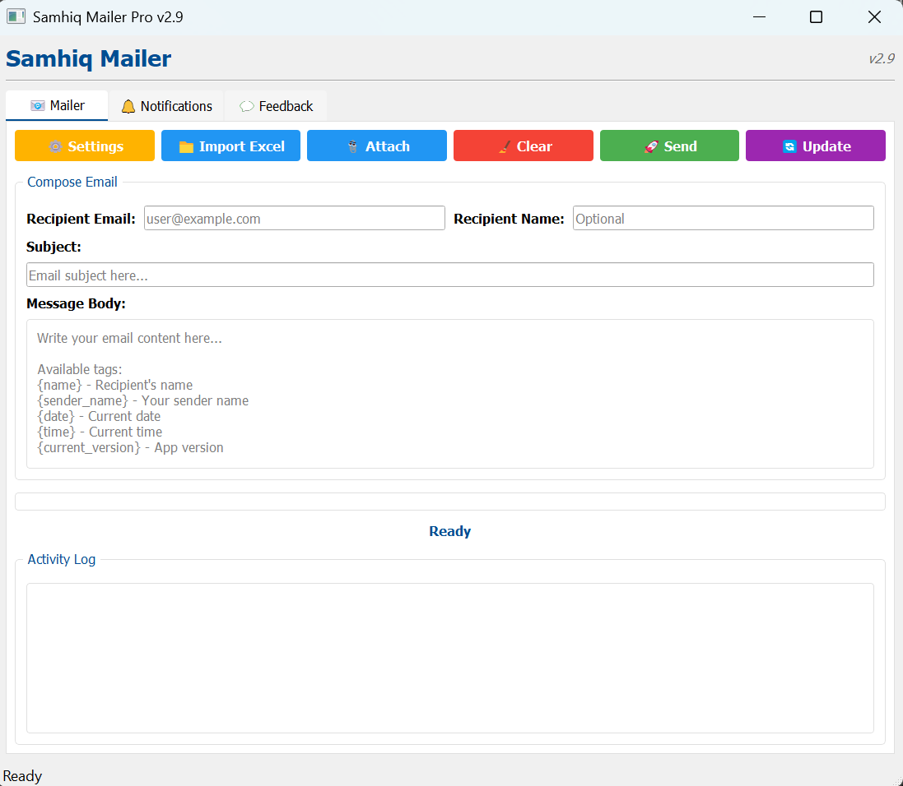

# 📬 Samhiq Mailer

**Samhiq Mailer** is a professional desktop application for sending personalized bulk emails using your own SMTP credentials. Designed for simplicity and power, it supports Excel-based recipient lists, attachments, smart retry logic, real-time delivery logs, and automatic updates — all packed in a portable `.exe` with no installation required.

  

---

## ✨ Features

- 🖥️ Clean and intuitive user interface  
- 📧 Works with Gmail, Outlook, Yahoo, Zoho, and other SMTP providers  
- 🔐 Secure one-time login (stored locally on your device)  
- 📂 Excel import for bulk sending and name personalization  
- 📝 Use `{name}` tags to dynamically personalize each message  
- 📎 Attach multiple files with a click  
- 🔄 Retries failed emails up to 3 times  
- 📊 Real-time progress bar and status log  
- 🔧 Built-in auto-update mechanism  
- 💼 No installation required — fully portable `.exe`

---

## 🚀 Getting Started

### 1️⃣ Download

➡️ [Download SamhiqMailer.exe](https://github.com/samhiq/SamhiqMailer/releases/latest/download/SamhiqMailer.exe)

---

### 2️⃣ Folder Setup

1. Create a folder named **`SamhiqMailer`**  
2. Place the `.exe` file inside this folder  

> ⚠️ The folder **must** be named `SamhiqMailer` exactly for updates to work correctly.

---

### 3️⃣ First Launch

- Double-click `SamhiqMailer.exe`  
- Enter your:
  - 📧 Email address  
  - 🔐 SMTP App Password

> 🔑 [How to create a Gmail App Password](https://support.google.com/accounts/answer/185833)  
> You only need to enter credentials once — they’re saved securely on your system.

---

## 📤 How to Send Emails

### 🧾 Step 1: Import Recipients

Click **📁 Import Excel** and choose a `.xlsx` file with this format:

| Email              | Name     |
|--------------------|----------|
| user@example.com   | John     |
| jane@domain.com    | Jane     |

---

### ✍️ Step 2: Compose Message

- Write your **Subject** and **Message Body**  
- Use `{name}` in the body to personalize messages

📌 Example:  
> Hello {name}, your subscription has been successfully activated.

---

### 📎 Step 3: Add Attachments (Optional)

Click **Add Attachment** to include one or more files.

---

### 🚀 Step 4: Send Emails

Click **Send Emails** — emails are sent one-by-one, with:

- Retry logic for failures  
- Real-time progress tracking  
- Detailed logs for transparency

---

## 🔄 Auto-Update System

- ✔️ Automatically checks for updates on every launch  
- 📥 Downloads and installs new versions without affecting your data  
- ⚙️ You can also manually check via the **Check for Updates** button

Your settings and login info remain untouched during updates.

---

## 🔐 Privacy

- ✅ All credentials are saved locally in `user_config.json`  
- ❌ No external data is collected, stored, or synced  
- 💻 Operates fully offline except for email sending and update checks

---

## ⚠️ Windows Defender / SmartScreen Notice

When you open `SamhiqMailer.exe` for the first time, Windows may show a warning like:

> **"Windows protected your PC"**

This message appears because the file is **not digitally signed with a verified security certificate**. Windows shows this warning by default for apps that haven’t been certified through its publisher verification process.

To run the application:

1. On the warning screen, click **More info**
2. Then click **Run anyway**

You usually won’t see this warning again for the same file after the first run.

---

## 👤 Developer

**Md Sameer Iqbal (Samhiq)**  
📍 Bihar, India  
📧 [contact.samhiq@gmail.com](mailto:contact.samhiq@gmail.com)  
🔗 [GitHub: @samhiq](https://github.com/samhiq)

> Built with precision. Designed for simplicity.  
> 🇮🇳 Proudly developed in India.

---

## 📄 License

This software is free to use, share, and distribute.  
✅ Commercial usage is allowed.  
© 2025 Md Sameer Iqbal. All rights reserved.

---
